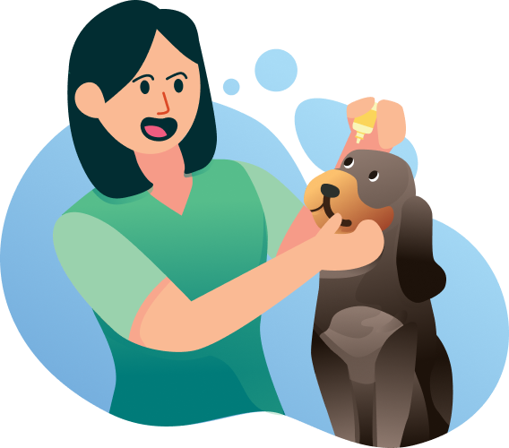
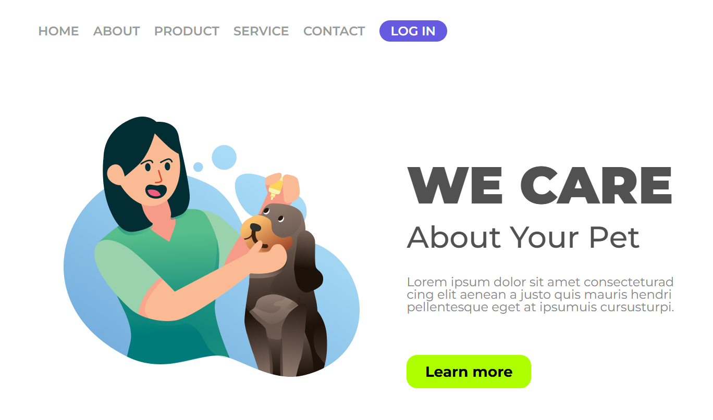
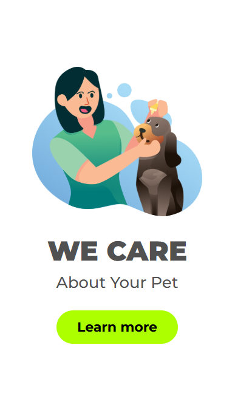

# 🐾 We Care About Your Pet - Landing Page
<div align="center">
   

</div>
## 📋 Sobre o Projeto

Este é um projeto de uma landing page single-page desenvolvida para apresentar um serviço de **cuidados com pets** (veterinária/pet shop). O objetivo é transmitir confiança e carinho no atendimento aos animais, com um design moderno, limpo e amigável.

A página contém seções como:
- **Home**
- **About**
- **Product**
- **Service**
- **Contact**
- Botão de **Log In**

Além de um call-to-action principal ("Learn more") para incentivar o visitante a conhecer melhor o serviço.

---

## 🚀 Tecnologias Utilizadas

- **HTML5** - Estrutura da página
- **CSS3** - Estilização e responsividade
- (Em breve) JavaScript para interações

---

## 📁 Estrutura do Projeto

Easy-Shopping-home/<br>
│<br>
├── assets/<br>
│ └── image.png # Preview da landing page<br>
│<br>
├── index.html # Página principal<br>
├── styles.css # Estilos personalizados<br>
└── README.md # Documentação do projeto<br>

---

## 📱 Funcionalidades

- ✅ Layout totalmente responsivo
- ✅ Navegação simples entre seções
- ✅ Design limpo e minimalista
- ✅ Botão de chamada para ação ("Get Started")

---

## 🖼️ Preview
<div align="center">
   


</div>
---

## 🔧 Como Executar

1. Clone este repositório:
   ```bash
   git clone https://github.com/HenriqueGalimberti1/Easy-Shopping-home.git

   Navegue até a pasta do projeto:
   cd Easy-Shopping-home

   Abra o arquivo index.html no seu navegador preferido.

## 🎯 Próximas Melhorias

- Implementar formulário de contato funcional
- Melhorar acessibilidade (ARIA labels)
- Integrar com redes sociais
- javascrip implementado

## 👨‍💻 Autor
Henrique Galimberti
- GitHub: @HenriqueGalimberti1

## ⭐ Não esqueça de dar uma estrela no repositório se gostou do projeto!
-- DevClub
  
